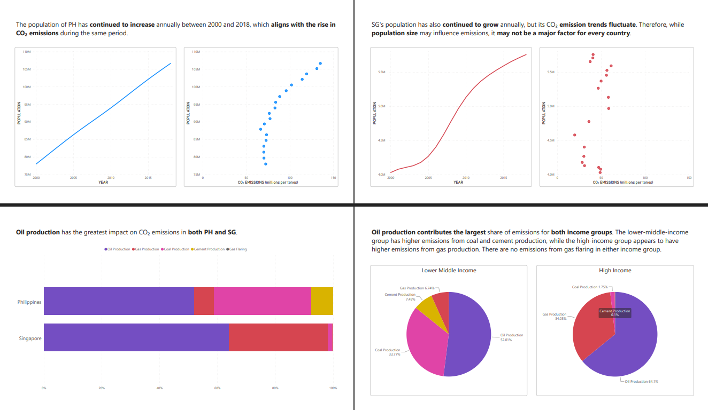
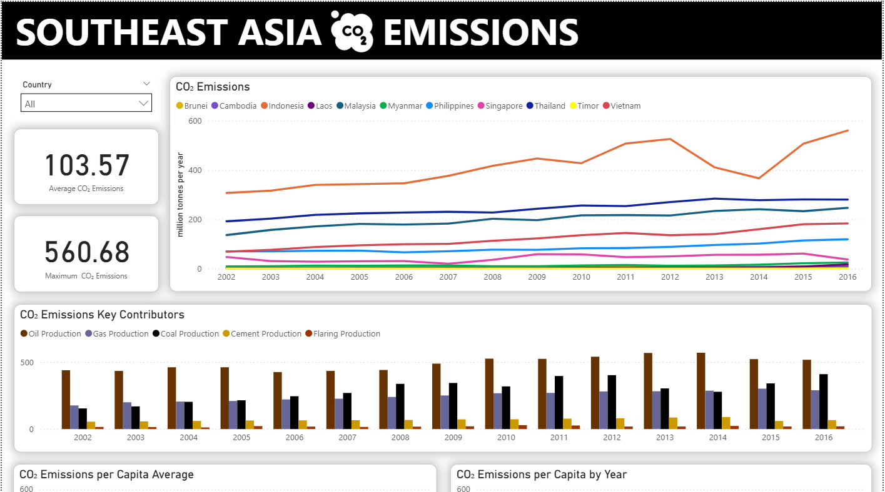
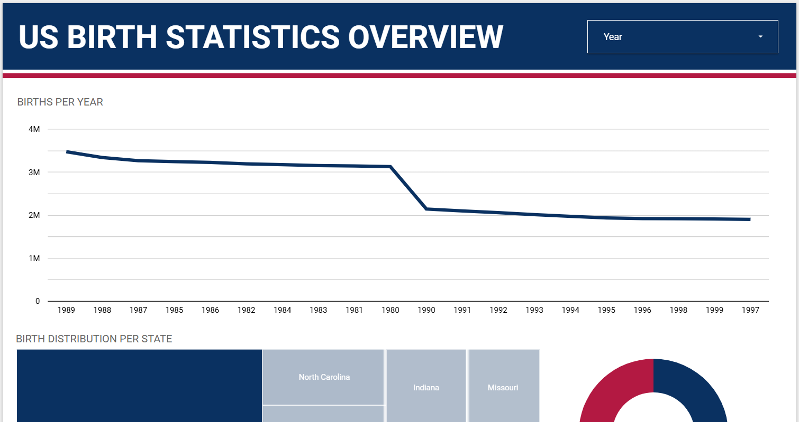

# PORTFOLIO

## DATA PREPARATION

Data extraction in SQL 
*  <strong>COVID-19 dataset (Italy) queries using Google BigQuery: <a href="https://github.com/analystkristle/projs_sql/blob/main/bigquery_covid19_italy_queries.sql">Queries</a></strong> 
*  
<strong>IMDB queries using Google BigQuery: <a href="https://github.com/analystkristle/projs_sql/blob/main/bigquery_imdb_queries.sql">Queries</a></strong> | <strong><a href="https://drive.google.com/file/d/1LMnbGtwRzrxo4vxLzF8oxGaFF7XVPiNY/view?usp=sharing">Data Dictionary</a></strong>

Data cleaning using Microsoft Excel & Power Query in Power BI

*   <strong>SEA Carbon Dioxide Emissions Data: <a href="https://drive.google.com/file/d/1twknZN_DvI0UFnUqBxG0P07Wu4wxjHce/view?usp=sharing">Link</a></strong> 

Data cleaning and analysis using Python

*   Work in progress. Updates coming soon.

## REPORTS & DASHBOARDS

  
  

  <strong>PH & SG Carbon Dioxide Emissions Report: <a href="https://drive.google.com/file/d/1imqnAunhdwbVWlzKXjZPW75DJ3s9Hcs-/view?usp=sharing">PDF</a></strong> | <strong><a href="https://drive.google.com/file/d/1LMnbGtwRzrxo4vxLzF8oxGaFF7XVPiNY/view?usp=sharing">Power BI Preview</a></strong> 
  This Power BI report provides an analysis of carbon dioxide emissions in the Philippines and Singapore, comparing the trends and factors influencing emissions in both countries. 
  <i>(Dataset Source: ourworldindata.org)</i>
  

  
  

  <strong>SEA Carbon Dioxide Emissions Dashboard: <a href="https://drive.google.com/file/d/1UHjx5OjQSQcZb4zHFHp78p4PJr-hkh_k/view?usp=sharing">PDF</a></strong> | <strong><a href="https://drive.google.com/file/d/1_gf_lLISZlyKQ-2KOQGZXztTPsz0Knwl/view?usp=sharing">Power BI Preview</a></strong> 
  This Power BI dashboard tracks carbon dioxide emissions over time, offering an overview of trends and main contributors. It also displays metrics such as emissions per capita, per unit of GDP, per energy unit, and consumption-based emissions. 
  <i>(Dataset Source: ourworldindata.org)</i>
  

  
  

  <strong>US Birth Statistics Overview Dashboard: <a href="https://lookerstudio.google.com/reporting/6c22ae81-c119-4f1f-8369-41ecda51b33d">Looker Studio View</a></strong> 
  This Looker Studio dashboard presents an overview of U.S. birth data from 1989 to 1990, covering trends and distributions. 
  <i>(Dataset Source: mavenanalytics.io)</i>
  

