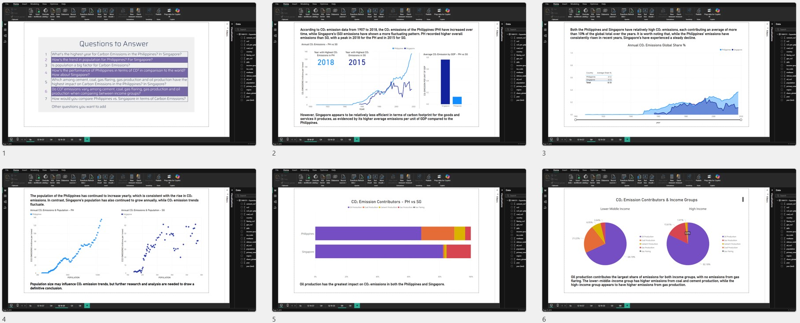

# DATA PROCESSING

#### **Data extraction in SQL**

*   Lorem ipsum: <a href="#">Link</a> 
*   Lorem ipsum: <a href="#">Link</a> 

#### **Data cleaning using Microsoft Excel & Google Sheets**

*   Lorem ipsum: <a href="#">Link</a> 
*   Lorem ipsum: <a href="#">Link</a> 
*   Lorem ipsum: <a href="#">Link</a> 
*   Lorem ipsum: <a href="#">Link</a> 

#### **Data cleaning and analysis using Python**

*   Lorem ipsum: <a href="#">Link</a> 
*   Lorem ipsum: <a href="#">Link</a> 

# REPORTS

  
  

  <strong>Lorem ipsum: <a href="#">Link</a></strong> 
  Lorem ipsum dolor sit amet consectetur adipiscing elit. Dolor sit amet consectetur adipiscing elit quisque faucibus.
  

  
  

  <strong>Lorem ipsum: <a href="#">Link</a></strong> 
  Lorem ipsum dolor sit amet consectetur adipiscing elit. Dolor sit amet consectetur adipiscing elit quisque faucibus.
  

  
  

  <strong>PH & SG Carbon Dioxide Emissions: <a href="https://drive.google.com/file/d/1xcV7NB1O1sieTMs0M7Q7vtT_7ldb3Epo/view?usp=drive_link">Link</a></strong> 
  The report provides an analysis of carbon dioxide emissions in the Philippines and Singapore, comparing the factors and trends influencing emissions in both countries. It was created during a data analytics bootcamp as an exercise using Power BI.
  

  
  

  <strong>Category A Insights Report: <a href="https://drive.google.com/file/d/1G17kao-_-LHtqYWN3_t7S6BssakW7cdp/view?usp=sharing">Link</a></strong> 
  The insight deck evaluated the market landscape of Category A in support of strategic planning. Key insights were identified to guide future actions and strengthen market positioning within the category. This was requested by a company to allow me to demonstrate my capabilities in market data analysis and interpretation. The deck was created using PowerPoint.
  

